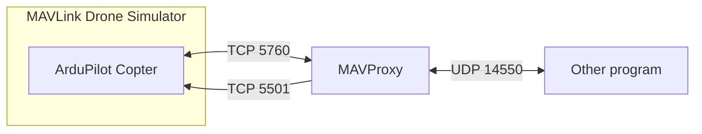

# MAVLink Drone Simulator

Platform agnostic wrapper for MAVLink drone simulators.

Link: https://github.com/Xierumeng/mavlink-drone-simulator

This program downloads and runs the ArduPilot Copter simulator:
* https://ardupilot.org/dev/docs/pre-built-binaries.html
* https://ardupilot.org/dev/docs/sitl-simulator-software-in-the-loop.html

## Usage

1. Open the command line
1. Change directory: `cd mavlink_drone_simulator/`
1. Run the program:
    * Windows: `./mavlink_drone_simulator.exe`
    * MacOS and Linux: `./mavlink_drone_simulator`
1. Change firewall settings as required
1. Done!

You can modify the simulator arguments in `config_simulator_arguments.txt` . More information on the arguments: https://ardupilot.org/planner/docs/mission-planner-simulation.html#extra-command-line

You can connect directly to the simulator. Refer to the architecture diagram for port numbers: https://ardupilot.org/dev/docs/sitl-simulator-software-in-the-loop.html#sitl-architecture

### MAVProxy

Alternatively, instead of connecting directly, you can use MAVProxy as an intermediary: https://ardupilot.org/mavproxy/docs/getting_started/download_and_installation.html
* In a separate command line window: `mavproxy.py --master tcp:127.0.0.1:5760 --sitl 127.0.0.1:5501 --out 127.0.0.1:14550`

Other programs (e.g. Mission Planner, your own code) can then connect to the `--out` address.

## Development

Follow the [instructions](INSTRUCTIONS.md).
